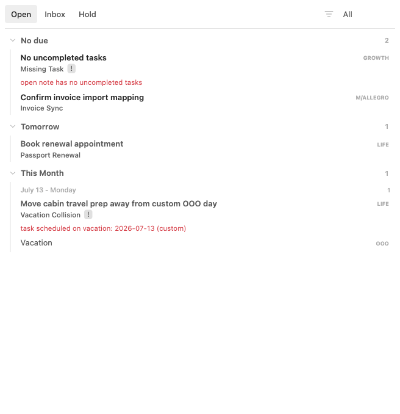
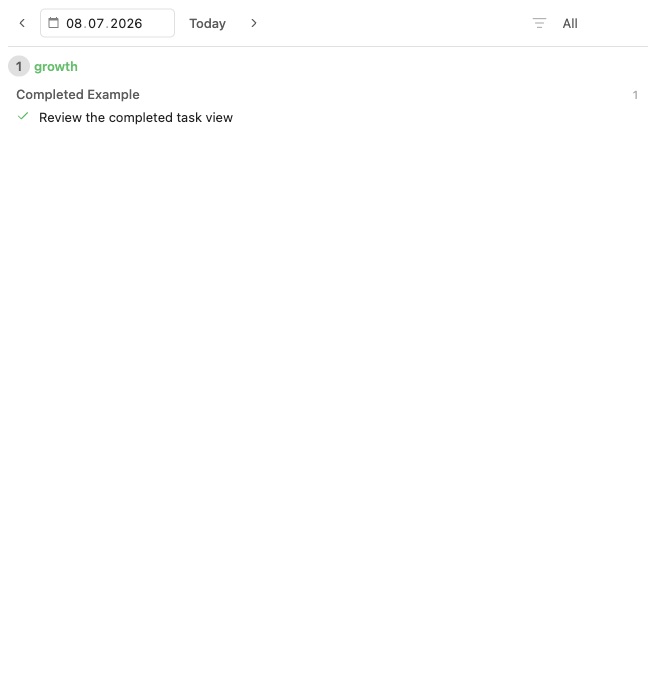
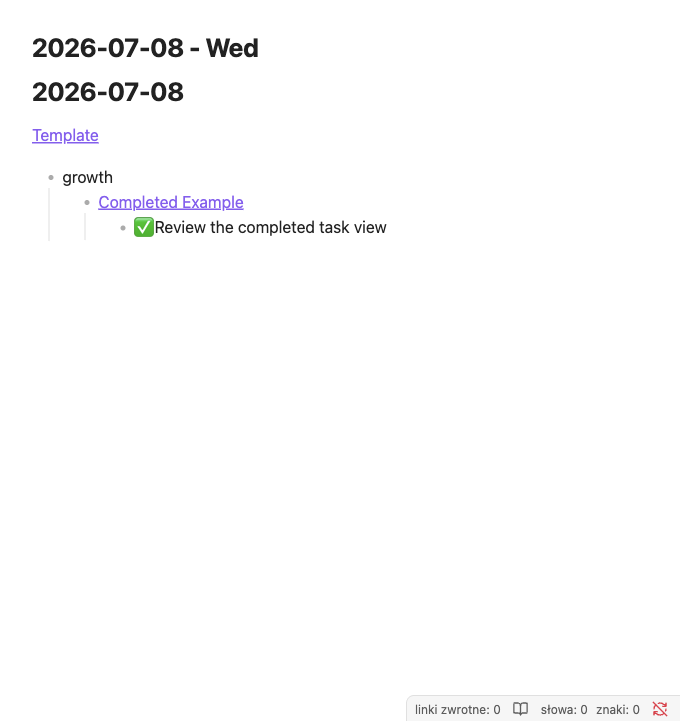

# Tasks Eye

Tasks Eye is a native Obsidian plugin for managing note-centered work queues on
top of the Tasks plugin. It renders focused Open, Inbox, Hold, and Done views
from regular markdown notes and Tasks emoji task metadata.

The full documentation site lives in [`docs/`](docs/) and is ready for GitHub
Pages configured as "deploy from branch" using the `/docs` folder. No GitHub
Actions workflow is required.

Tasks Eye expects notes to live under `Db/` and daily notes to live under
`Timeline/`. A note's work status is stored in frontmatter:

```yaml
---
status: open
---
```

Supported statuses are `open`, `hold`, `closed`, and `archived`. Missing or blank
status is treated as `open`.

## Requirements

- Obsidian desktop `1.10.0` or newer.
- Tasks community plugin. Tasks Eye uses the Tasks plugin API to complete tasks
  without reimplementing Tasks' emoji format.

## Views

### Open

Open shows actionable notes grouped by due date. Future work stays `status: open`
and is deferred by adding a Tasks due date (`📅 YYYY-MM-DD`).



### Inbox

Inbox shows notes that need attention, such as open notes with no remaining
unchecked task or notes with invalid status frontmatter.

### Hold

Hold shows notes with `status: hold`, grouped with the same board mechanics as
Open.

### Done

Done shows completed Tasks items for a selected date, grouped by note context.



## Daily Completed Summary

Tasks Eye registers the `tasks-eye-daily-completed` markdown code block:

````markdown
```tasks-eye-daily-completed
```
````

The legacy `eye-daily-completed` block name is also supported as a migration
alias.



## Commands

- `Tasks Eye: Open Tasks Eye: open`
- `Tasks Eye: Open Tasks Eye: inbox`
- `Tasks Eye: Open Tasks Eye: hold`
- `Tasks Eye: Create new Tasks Eye note`
- `Tasks Eye: Open Tasks Eye Done`
- `Tasks Eye: Uncheck selected tasks`

## Development

```bash
npm install
npm test
npm run build
```

Acceptance testing runs a sandboxed Obsidian app against a copied fixture vault:

```bash
npm run acceptance:test
```

See [docs/testing.md](docs/testing.md) for the WDIO architecture, artifact
locations, and screenshot update workflow.
