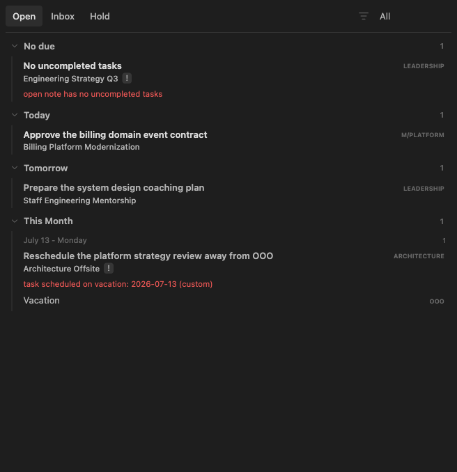
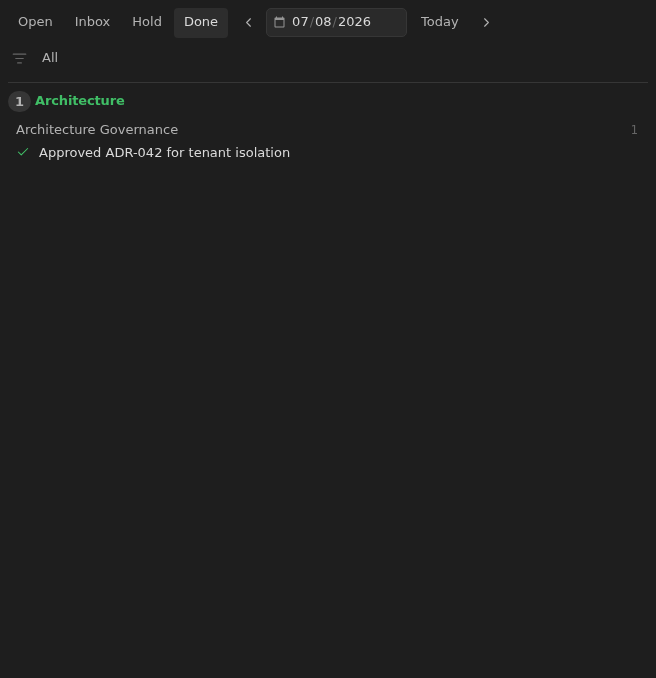

# Tasks Eye

Tasks Eye is a native Obsidian plugin for managing note-centered work queues on
top of the Tasks plugin. Its single native view provides focused Open, Inbox,
Hold, and Done modes from regular markdown notes and Tasks emoji task metadata.

The full documentation site lives in [`docs/`](docs/) and is ready for GitHub
Pages configured as "deploy from branch" using the `/docs` folder. No GitHub
Actions workflow is required. The docs build defaults to the project Pages base
path `/ggajos-tasks-eye/`; set `DOCS_SITE` and `DOCS_BASE` when building for a
custom domain or another mount point.

Tasks Eye manages Markdown notes under the configured notes folder and all of
its subfolders. The setting defaults to the vault root (`/`). Change the folder
from **Settings → Tasks Eye → Notes folder**. A note's work status is stored
in frontmatter:

```yaml
---
status: open
---
```

Supported statuses are `open`, `hold`, `closed`, and `archived`. Missing or blank
status is treated as `open`.

## Requirements

- Obsidian desktop `1.10.0` or newer.
- Tasks community plugin. Tasks Eye uses the Tasks plugin API to complete tasks
  without reimplementing Tasks' emoji format.

## Views

The eye ribbon icon opens one Tasks Eye view. Use its Open, Inbox, Hold, and Done
tabs to keep every task workflow in the same Obsidian leaf.

### Open

Open shows actionable notes grouped by due date. Future work stays `status: open`
and is deferred by adding a Tasks due date (`📅 YYYY-MM-DD`).



### Inbox

Inbox shows notes that need attention, such as open notes with no remaining
unchecked task, open notes whose unchecked tasks have no due date, or notes
with invalid status frontmatter.

### Hold

Hold shows notes with `status: hold`, grouped with the same board mechanics as
Open.

### Done

Done shows completed Tasks items for a selected date, grouped by note context,
inside the same Tasks Eye view as the work queues.



## Commands

- `Tasks Eye: Open Tasks Eye: open`
- `Tasks Eye: Open Tasks Eye: inbox`
- `Tasks Eye: Open Tasks Eye: hold`
- `Tasks Eye: Create new Tasks Eye note`
- `Tasks Eye: Open Tasks Eye Done`
- `Tasks Eye: Uncheck selected tasks`

## Development

Use Node `22.13.0` or newer.

```bash
npm install
npm test
```

Useful focused commands are:

```bash
npm run build
npm run test:unit
npm run test:acceptance
npm run test:visual
npm run docs
```

Behavioral acceptance testing runs a sandboxed Obsidian app locally against a
copied fixture vault. It does not capture documentation screenshots:

```bash
npm run test:acceptance
```

Visual tests never run directly on the development machine. The sole visual
entry point starts a pinned Linux ARM64 container in Podman, where Obsidian runs
under Xvfb and a window manager. It cannot move, focus, or cover local windows:

```bash
npm run test:visual
# review the printed HTML report path
npm run test:visual:approve
```

The first visual run builds a cached image and downloads its isolated Obsidian
runtime. Later runs reuse both caches. Install Podman Desktop first; on macOS,
create its VM once with `podman machine init` if one does not already exist.
The command never edits committed screenshots. Review expected, actual, and
difference images in the printed local HTML report, then use
`npm run test:visual:approve` to promote intentional changes and rebuild docs.

Feature-owned executable documentation lives under `features/<slug>/`. A
feature folder can provide typed metadata, `why.md`, focused Vitest specs, and
isolated WDIO fixtures/screenshots that feed generated documentation. Standard
violation fixtures also generate their model contracts and screenshots.

The acceptance and documentation structure is:

- `acceptance/fixtures/base/` is a minimal seed vault.
- `acceptance/specs/` discovers feature acceptance and screenshot scenarios.
- `acceptance/snapshots/docs/features/` stores reviewed screenshot baselines.
- `acceptance/artifacts/visual/` stores ignored actual images, diffs, the run
  manifest, and the HTML report.
- `acceptance/Containerfile.visual` pins the Linux display, fonts, and Electron
  runtime dependencies.
- `features/<slug>/` owns typed metadata, rationale, tests, fixtures, and
  optional WDIO scenarios.
- `docs-src/` contains authored public-doc templates and generated staging;
  `docs/` is the generated GitHub Pages output.

Each acceptance or screenshot scenario declares a complete `FeatureFixture`.
Use `fixture()`, `note()`, and `task()` for normal notes, and literal Markdown
when exact or malformed syntax is under test. Scenarios must not inherit notes
from another feature. A violation fixture drives its model contract and the
standard Inbox/Open screenshots; a custom scenario with the same screenshot
slug replaces that generated flow.

Local behavioral acceptance uses the latest Obsidian and Tasks plugin by
default. Podman screenshots pin Obsidian `1.12.7`, Tasks `8.2.2`, Minimal
`8.2.1`, Inter fonts, device pixel ratio `1`, and a `1030x824` display. Override
behavioral versions when diagnosing compatibility:

```bash
OBSIDIAN_VERSIONS="1.12.7/latest" TASKS_PLUGIN_VERSION=8.2.2 npm run test:acceptance
```

The visual review workflow is:

1. Run `npm run test:acceptance` for quick behavioral feedback.
2. Run `npm run test:visual` when UI or feature docs may have changed.
3. Review every expected/actual/diff entry in the printed HTML report.
4. Run `npm run test:visual:approve` only for intentional differences.
5. Rerun `npm run test:visual` and confirm a clean baseline.

`TASKS_EYE_TODAY` fixes the acceptance date. Captures wait for fonts and
disable animation, blinking carets, scrollbars, and pointer hit testing;
scenarios that document focus establish it explicitly. Missing, changed,
stale, or incomplete captures fail without mutating committed baselines.

## Releases

Releases use a local `release-it` flow. Requirements are Node `22.13.0` or
newer, an authenticated GitHub CLI (`gh auth status`), push access to `origin`,
a clean worktree, and the `master` branch.

```bash
# Next BRAT beta, for example 6.0.0-beta.2 → 6.0.0-beta.3
npm run release

# Next public Obsidian release, for example 6.0.0-beta.3 → 6.0.0
npm run release:public
```

Both commands verify version metadata, run the complete `npm test` gate
(including Podman visual tests and generated docs), build `main.js`, bump the
version, update public metadata when applicable, commit, tag without a `v`
prefix, push, and create the GitHub release. Beta releases keep the repository
`manifest.json` on the latest public version but upload a beta-version manifest
for BRAT. Release assets are `manifest.json`, `main.js`, and `styles.css` when
present; `main.js` remains ignored by git.

BRAT installs this repository as `ggajos/ggajos-tasks-eye`. Beta releases are
GitHub pre-releases; public releases use plain semantic versions.

If a release fails before the version bump, fix the cause and rerun it. If it
fails after the bump but before the release commit, restore the metadata first:

```bash
git restore package.json package-lock.json manifest.json versions.json
npm run release # or npm run release:public
```

If the tag was pushed but GitHub release creation failed, finish it with:

```bash
node scripts/obsidian-release.mjs github-release <version>
```
