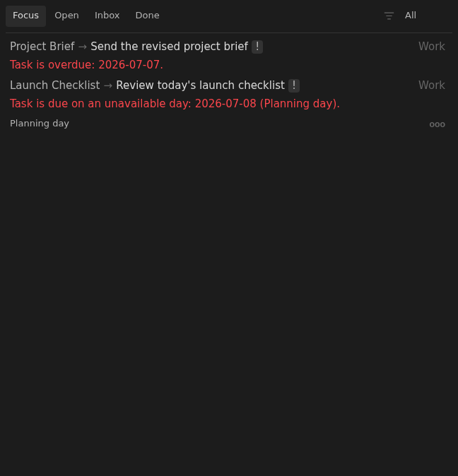
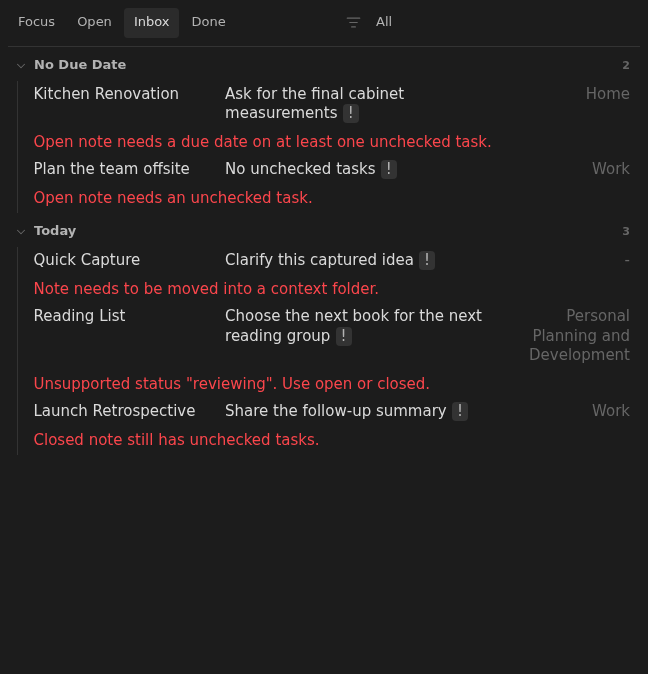

# Tasks Eye

Tasks Eye brings a familiar GTD loop to Markdown notes in Obsidian. Capture an
idea, give the note a physical next action and an attention date, then trust
Focus to show what needs a decision today. Your notes and Obsidian Tasks
checkboxes remain the source of truth.

## A small, trusted system

Start with one managed folder and a few broad, non-overlapping contexts:

```text
Tasks/
├── Work/
└── Private/
```

Use **Create new note** (<kbd>Ctrl+Shift+N</kbd>) to capture into the right
context. When choosing a context would interrupt you, leave the note in
`Tasks/` and route it later from Inbox.

An active note needs an unchecked next action with a Tasks due date:

```md
# Renew passport

- [ ] Find the required documents 📅 2026-08-03
- [ ] Take a compliant photo
- [ ] Submit the application
```

Treat `📅` as the **next attention date**: when the note should return to you,
not necessarily its external deadline. Tasks Eye surfaces the earliest
unchecked dated task while keeping the plan, links, and history in the note.

## Work Focus to zero

Open **Focus** with <kbd>Ctrl+1</kbd>. It shows open notes whose next action is
due today or overdue.



Handle every row deliberately:

- Complete the visible next action.
- Move its attention date.
- Close the note when it no longer needs attention.

Focus Zero means every item asking for attention today received a decision. It
does not mean finishing every possible task.

## Repair Inbox to zero

Tasks Eye's Inbox is a GTD-style capture aid and a broader **repair queue**. It
finds notes that still need a context, an unchecked next action, an attention
date, or a valid state.



The everyday rhythm is:

1. Handle Focus to zero.
2. Repair Inbox to zero.
3. Use Open to review active outcomes and future attention dates.
4. Run a regular review to confirm that the system still represents reality.

## GTD concepts in Tasks Eye

- A **note** is a broad work container: it may be a project, standalone action,
  waiting item, or recurring responsibility.
- **Open** is the inventory of active notes with their next-action previews.
- **Folders** provide deliberately minimal contexts such as Work and Private.
- **Waiting For** becomes a dated follow-up action in the relevant note.
- **Someday / Maybe** can be one periodically reviewed note containing ideas
  and links.
- Fixed appointments and day-specific commitments stay in your **calendar**.
- Reference material stays outside the managed folder or in a closed note.

Read the
[complete GTD quickstart](https://ggajos.com/ggajos-tasks-eye/gtd-quickstart/)
for processing decisions, review patterns, examples, and the full concept
mapping. The
[feature documentation](https://ggajos.com/ggajos-tasks-eye/) explains every
view, command, and Inbox validation rule.

## Install with BRAT

Tasks Eye requires Obsidian 1.12.7 or newer and the
[Tasks](https://obsidian.md/plugins?id=obsidian-tasks-plugin) community plugin.

1. Install and enable **Tasks** from Obsidian's Community Plugins.
2. Install and enable
   [BRAT](https://obsidian.md/plugins?id=obsidian42-brat).
3. In BRAT settings, choose **Add Beta Plugin** and enter
   `https://github.com/ggajos/ggajos-tasks-eye`.
4. Enable **Tasks Eye** in Community Plugins.

BRAT will install Tasks Eye and keep it updated from this repository's releases.
